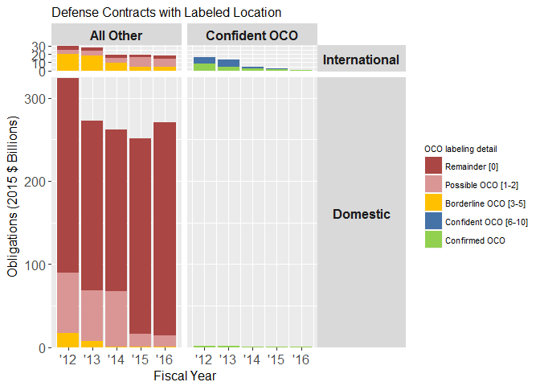
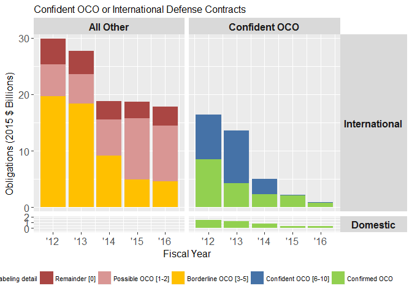
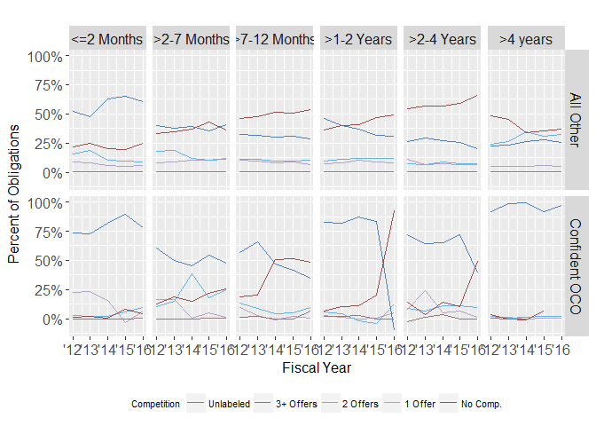
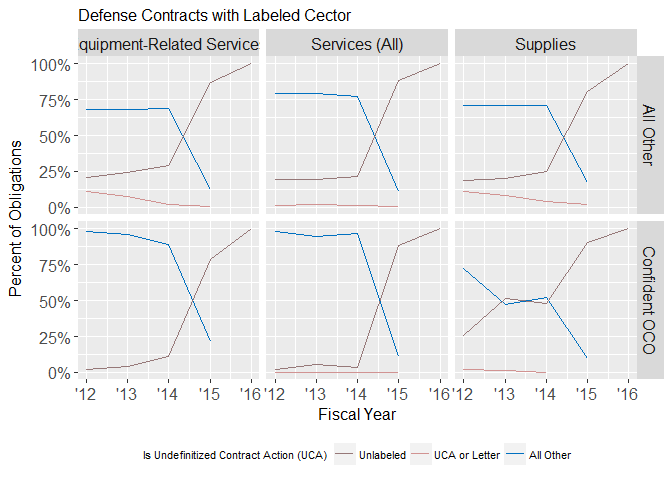
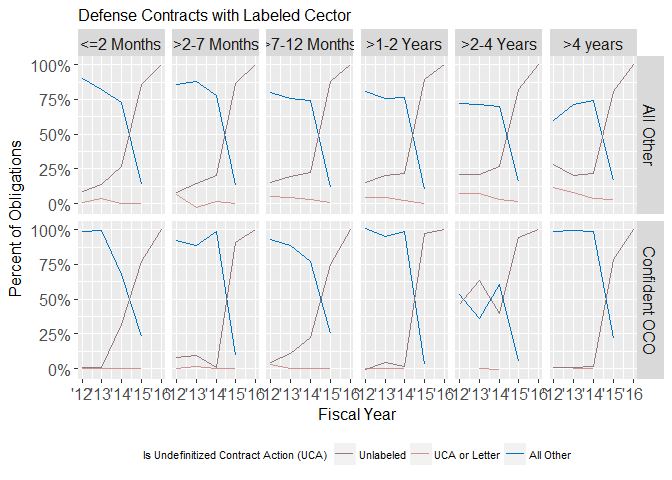
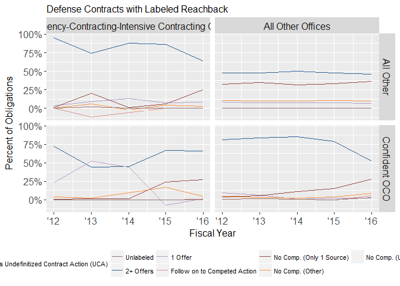

# Crisis Funding Exploration
Greg Sanders  
March 28, 2017  


## R Markdown

This is an R Markdown document. Markdown is a simple formatting syntax for authoring HTML, PDF, and MS Word documents. For more details on using R Markdown see <http://rmarkdown.rstudio.com>.

When you click the **Knit** button a document will be generated that includes both content as well as the output of any embedded R code chunks within the document. You can embed an R code chunk like this:


##Import Data

```r
# read in data    
ZipFile<-unz(file.path("Data","Defense_budget_SP_LocationVendorCrisisFundingHistoryBucketCustomer.zip"),
             "Defense_budget_SP_LocationVendorCrisisFundingHistoryBucketCustomer.csv")
FullData <- read.csv(ZipFile,
                     na.strings="NULL")
rm(ZipFile)

FullData<-apply_lookups(Path,FullData)
```

```
## Joining by: ProductOrServiceArea
```

```
## Joining by: Vendor.Size
```

```
## Joining by: CompetitionClassification, ClassifyNumberOfOffers
```

```
## Joining by: Fiscal.Year
```

```
## Warning in apply_lookups(Path, FullData): NaNs produced
```

```r
FullData<-subset(FullData, year(Fiscal.Year)>=2000)
```


##Points

```r
FullData$OCOcrisisScore<-round(FullData$OCOcrisisScore)
FullData$IsOCOcrisisFunding<-factor(ifelse(FullData$CrisisFunding=="OCO","OCO","All Other"))
FullData$IsOCOcrisisFunding[is.na(FullData$IsOCOcrisisFunding)]<-"All Other"
FullData$OCOcrisisScore[FullData$OCOcrisisScore<0]<-0
FullData$OCOscore<-cut2(FullData$OCOcrisisScore,c(1,3,6))


FullData$Theater<-FullData$CrisisFundingTheater
levels(FullData$Theater)<-c("Afghanistan"="Afghanistan and Iraq",
                            "Domestic"="Domestic",
                            "Iraq"="Afghanistan and Iraq",
                            "Regional Support"="Regional Support",
                            "Rest of World"="Rest of World")
FullData$Theater<-ordered(FullData$Theater,levels=c("Afghanistan and Iraq","Regional Support","Rest of World","Domestic"))

FullData$International<-FullData$Theater
levels(FullData$International)<-c("Afghanistan and Iraq"="International",
                            "Regional Support"="International",
                            "Rest of World"="International",
                            "Domestic"="Domestic")
FullData$International<-ordered(FullData$International,levels=c("International","Domestic"))


Evaluation<-Points<-ddply(FullData,
                .(
                  IsOCOcrisisFunding,
                  OCOcrisisScore,
                  Theater
                  ),
                plyr::summarise,
                Obligations=sum(Obligation.2015)
                )


Evaluation<-ddply(Evaluation,
                .(
                  OCOcrisisScore,
                  Theater
                  ),
                plyr::mutate,
                pObligations=Obligations/sum(Obligations)
                )


Evaluation$OCOscore<-ordered(Evaluation$OCOcrisisScore)
ggplot(subset(Evaluation,IsOCOcrisisFunding=="OCO" & !is.na(Theater)),aes(y=pObligations,fill=Theater,x=Theater))+
  geom_bar(stat="identity")+
  facet_wrap(  ~ OCOcrisisScore, nrow=2)+ scale_y_continuous("Percent of Obligations",labels = scales::percent)+ theme(axis.text.x = element_text(angle = 90, hjust = 1))
```

<!-- -->

```r
Points<-ddply(FullData,
                .(
                  Fiscal.Year,
                  IsOCOcrisisFunding,
                  OCOscore
                  ),
                plyr::summarise,
                Obligations=sum(Obligation.2015)
                )


Points<-ddply(Points,
                .(
                  Fiscal.Year,
                  IsOCOcrisisFunding
                  ),
                plyr::mutate,
                pObligations=Obligations/sum(Obligations)
                )


ggplot(Points,aes(x=Fiscal.Year,y=pObligations,fill=OCOscore))+
  geom_bar(stat="identity")+
  facet_grid(  ~ IsOCOcrisisFunding)
```

<!-- -->

```r
PointsRegion<-ddply(FullData,
                .(
                  Fiscal.Year,
                  IsOCOcrisisFunding,
                  OCOscore,
                  Theater
                  ),
                plyr::summarise,
                Obligations=sum(Obligation.2015)
                )


PointsRegion<-ddply(PointsRegion,
                .(
                  Fiscal.Year,
                  IsOCOcrisisFunding,
                  Theater
                  ),
                plyr::mutate,
                pObligations=Obligations/sum(Obligations)
                )

PointsRegion$OCOscore<-ordered(PointsRegion$OCOscore)
ggplot(subset(PointsRegion,!is.na(Theater)),aes(x=Fiscal.Year,y=pObligations,fill=OCOscore))+
  geom_bar(stat="identity")+
  facet_grid(  IsOCOcrisisFunding ~  Theater)+ scale_y_continuous("Percent of Obligations",labels = scales::percent)+ scale_x_date("Fiscal Year",labels = date_format("'%y"))
```

<!-- -->


##Labeling

```r
FullData$OCOlabelDetail<-NA
FullData$OCOlabelDetail[FullData$CrisisFunding=="OCO"]<-"Confirmed OCO"
FullData$OCOlabelDetail[FullData$OCOscore=="[ 6,10]"&is.na(FullData$OCOlabelDetail)]<-"Confident OCO [6-10]"
FullData$OCOlabelDetail[FullData$OCOscore=="[ 3, 6)"&is.na(FullData$OCOlabelDetail)]<-"Borderline OCO [3-5]"
FullData$OCOlabelDetail[FullData$OCOscore=="[ 1, 3)"&is.na(FullData$OCOlabelDetail)]<-"Possible OCO [1-2]"
FullData$OCOlabelDetail[FullData$OCOscore==" 0"&is.na(FullData$OCOlabelDetail)]<-"Remainder [0]"
FullData$OCOlabelDetail<-factor(FullData$OCOlabelDetail)
FullData$IsCSISOCO<-"All Other"
FullData$IsCSISOCO[FullData$CrisisFunding=="OCO"|FullData$OCOcrisisScore>=6]<-"Confident OCO"

FullData$OCOlabelDetail<-ordered(FullData$OCOlabelDetail,c("Remainder [0]","Possible OCO [1-2]","Borderline OCO [3-5]","Confident OCO [6-10]",
                                                           "Confirmed OCO"))


Dollars<-ddply(FullData,
                .(
                  Fiscal.Year,
                  OCOlabelDetail,
                  IsCSISOCO
                  ),
                plyr::summarise,
                Obligations=sum(Obligation.2015)
                )


ggplot(Dollars,aes(x=Fiscal.Year,y=Obligations,fill=OCOlabelDetail))+
  geom_bar(stat="identity")+
  facet_grid(  ~ IsCSISOCO)+scale_fill_discrete(guide = guide_legend(reverse=FALSE))
```

<!-- -->

```r
DollarsTheater<-ddply(FullData,
                .(
                  Fiscal.Year,
                  OCOlabelDetail,
                  IsCSISOCO,
                  Theater
                  ),
                plyr::summarise,
                Obligations=sum(Obligation.2015)
                )


FullData[FullData$PlaceCountryText %in% c("Jordan","Turkey"),]
```

```
##  [1] Fiscal.Year                        CompetitionClassification         
##  [3] ClassifyNumberOfOffers             Vendor.Size                       
##  [5] ProductOrServiceArea               SimpleArea                        
##  [7] ContractCrisisFunding              ContractingCustomer               
##  [9] ContractingSubCustomer             nationalinterestactioncodeText    
## [11] NIAcrisisFunding                   IsOCOcrisisFunding                
## [13] CrisisFunding                      CrisisFundingTheater              
## [15] PlaceCountryText                   VendorCountryText                 
## [17] VendorPlaceType                    UnmodifiedUltimateDurationCategory
## [19] OMBagencyName                      OMBbureauName                     
## [21] isUndefinitizedAction              OCOcrisisScore                    
## [23] OfficeOCOcrisisScore               Action.Obligation                 
## [25] numberOfActions                    ProductServiceOrRnDarea           
## [27] ServicesCategory.detail            ServicesCategory.sum              
## [29] ProductsCategory.detail            ProductOrServiceArea.DLA          
## [31] ProductOrServicesCategory.Graph    ServicesCategory.sum.1            
## [33] SupplyServiceFRC                   SupplyServiceERS                  
## [35] Vendor.Size.detail                 Vendor.Size.sum                   
## [37] Shiny.VendorSize                   Competition.detail                
## [39] Competition.sum                    Competition.effective.only        
## [41] Competition.multisum               No.Competition.sum                
## [43] Deflator.2005                      Deflator.2011                     
## [45] Deflator.2012                      Deflator.2013                     
## [47] Deflator.2014                      Deflator.2015                     
## [49] X                                  X.1                               
## [51] X.2                                X.3                               
## [53] X.4                                GDPdeflator                       
## [55] Obligation.2013                    Obligation.2014                   
## [57] Obligation.2015                    LogOfAction.Obligation            
## [59] Fiscal.Year.End                    Fiscal.Year.Start                 
## [61] Graph                              OCOscore                          
## [63] Theater                            International                     
## [65] OCOlabelDetail                     IsCSISOCO                         
## <0 rows> (or 0-length row.names)
```

```r
ggplot(subset(DollarsTheater,!is.na(Theater)),aes(x=Fiscal.Year,y=Obligations,fill=OCOlabelDetail))+
  geom_bar(stat="identity")+
  facet_grid(Theater  ~ IsCSISOCO, scales="free_y",space="free_y")+
  scale_fill_discrete(guide = guide_legend(reverse=FALSE))+
  theme(strip.text.y = element_text(angle = 0))
```

<!-- -->

```r
DollarsInternational<-ddply(FullData,
                .(
                  Fiscal.Year,
                  OCOlabelDetail,
                  IsCSISOCO,
                  International
                  ),
                plyr::summarise,
                Obligations=sum(Obligation.2015)
                )


FullData[FullData$PlaceCountryText %in% c("Jordan","Turkey"),]
```

```
##  [1] Fiscal.Year                        CompetitionClassification         
##  [3] ClassifyNumberOfOffers             Vendor.Size                       
##  [5] ProductOrServiceArea               SimpleArea                        
##  [7] ContractCrisisFunding              ContractingCustomer               
##  [9] ContractingSubCustomer             nationalinterestactioncodeText    
## [11] NIAcrisisFunding                   IsOCOcrisisFunding                
## [13] CrisisFunding                      CrisisFundingTheater              
## [15] PlaceCountryText                   VendorCountryText                 
## [17] VendorPlaceType                    UnmodifiedUltimateDurationCategory
## [19] OMBagencyName                      OMBbureauName                     
## [21] isUndefinitizedAction              OCOcrisisScore                    
## [23] OfficeOCOcrisisScore               Action.Obligation                 
## [25] numberOfActions                    ProductServiceOrRnDarea           
## [27] ServicesCategory.detail            ServicesCategory.sum              
## [29] ProductsCategory.detail            ProductOrServiceArea.DLA          
## [31] ProductOrServicesCategory.Graph    ServicesCategory.sum.1            
## [33] SupplyServiceFRC                   SupplyServiceERS                  
## [35] Vendor.Size.detail                 Vendor.Size.sum                   
## [37] Shiny.VendorSize                   Competition.detail                
## [39] Competition.sum                    Competition.effective.only        
## [41] Competition.multisum               No.Competition.sum                
## [43] Deflator.2005                      Deflator.2011                     
## [45] Deflator.2012                      Deflator.2013                     
## [47] Deflator.2014                      Deflator.2015                     
## [49] X                                  X.1                               
## [51] X.2                                X.3                               
## [53] X.4                                GDPdeflator                       
## [55] Obligation.2013                    Obligation.2014                   
## [57] Obligation.2015                    LogOfAction.Obligation            
## [59] Fiscal.Year.End                    Fiscal.Year.Start                 
## [61] Graph                              OCOscore                          
## [63] Theater                            International                     
## [65] OCOlabelDetail                     IsCSISOCO                         
## <0 rows> (or 0-length row.names)
```

```r
ggplot(subset(DollarsInternational,!is.na(International)),
       aes(x=Fiscal.Year,y=Obligations,fill=OCOlabelDetail))+
  geom_bar(stat="identity")+
  facet_grid(International  ~ IsCSISOCO, scales="free_y",space="free_y")+
  scale_fill_discrete(guide = guide_legend("OCO labeling detail",reverse=FALSE))+
  theme(strip.text.y = element_text(angle = 0))+scale_y_continuous("Obligations (2015 $ Billions)")+scale_x_date("Fiscal Year")
```

<!-- -->

```r
OCOdetail<-LatticePlotWrapper(
  VAR.color.legend.label="OCO labeling detail",
  VAR.main.label="",
  VAR.X.label="Fiscal Year",
  VAR.Y.label="Obligations (2015 $ Billions)",
  VAR.Coloration=Coloration,
  VAR.long.DF=subset(DollarsInternational,!is.na(International)),
  # NA, #VAR.ncol
  VAR.x.variable="Fiscal.Year", #VAR.x.variable
  VAR.y.variable="Obligations", #VAR.y.variable
  VAR.y.series="OCOlabelDetail", #VAR.y.series
  VAR.facet.primary="International", #VAR.facet.primary
  VAR.facet.secondary="IsCSISOCO" # VAR.facet.secondary=NA
  # ,MovingAverage=0
  # ,MovingSides=1
  # ,DataLabels=NA
  #                       ,VAR.override.coloration=NA
)
```

```
## Warning in `levels<-`(`*tmp*`, value = if (nl == nL) as.character(labels)
## else paste0(labels, : duplicated levels in factors are deprecated
```

```r
OCOdetail+theme(legend.position="right")
```

```
## Warning in `levels<-`(`*tmp*`, value = if (nl == nL) as.character(labels)
## else paste0(labels, : duplicated levels in factors are deprecated
```

```
## Warning in grid.Call(L_textBounds, as.graphicsAnnot(x$label), x$x, x$y, :
## font family not found in Windows font database

## Warning in grid.Call(L_textBounds, as.graphicsAnnot(x$label), x$x, x$y, :
## font family not found in Windows font database
```

<!-- -->

##Country

```r
Country<-ddply(FullData,
                .(Fiscal.Year,
                  IsCSISOCO,
                  PlaceCountryText,
                  Theater
                  ),
                plyr::summarise,
                Obligations=sum(Obligation.2015)
                )

write.csv(Country,file.path("Output","Country.csv"))


ggplot(Dollars,aes(x=Fiscal.Year,y=Obligations,fill=OCOlabelDetail))+
  geom_bar(stat="identity")+
  facet_grid(  ~ IsCSISOCO)+scale_fill_discrete(guide = guide_legend(reverse=FALSE))
```

<!-- -->

```r
OCOdetailZoom<-LatticePlotWrapper(
  VAR.color.legend.label="OCO labeling detail",
  VAR.main.label="",
  VAR.X.label="Fiscal Year",
  VAR.Y.label="Obligations (2015 $ Billions)",
  VAR.Coloration=Coloration,
  VAR.long.DF=subset(DollarsInternational,
                     (IsCSISOCO=="Confident OCO" | 
                       International=="International") & 
                       !is.na(International)),
  # NA, #VAR.ncol
  VAR.x.variable="Fiscal.Year", #VAR.x.variable
  VAR.y.variable="Obligations", #VAR.y.variable
  VAR.y.series="OCOlabelDetail", #VAR.y.series
  VAR.facet.primary="International", #VAR.facet.primary
  VAR.facet.secondary="IsCSISOCO" # VAR.facet.secondary=NA
  # ,MovingAverage=0
  # ,MovingSides=1
  # ,DataLabels=NA
  #                       ,VAR.override.coloration=NA
)
```

```
## Warning in `levels<-`(`*tmp*`, value = if (nl == nL) as.character(labels)
## else paste0(labels, : duplicated levels in factors are deprecated
```

```r
OCOdetailZoom
```

```
## Warning in `levels<-`(`*tmp*`, value = if (nl == nL) as.character(labels)
## else paste0(labels, : duplicated levels in factors are deprecated
```

```
## Warning in grid.Call(L_textBounds, as.graphicsAnnot(x$label), x$x, x$y, :
## font family not found in Windows font database

## Warning in grid.Call(L_textBounds, as.graphicsAnnot(x$label), x$x, x$y, :
## font family not found in Windows font database
```

<!-- -->

##DuplicateCompetition

```r
# FullData$No.Competition.sum<-ordered(FullData$No.Competition.sum,
#                                                         c("2+ Offers","1 Offer", 
#                                                           "No Competition (Only One Source Exception)"
#                                                           ,"No Competition (Follow on to competed action)",
#                                                           "No Competition (Other Exception)",
#                                                           "No Competition (Unlabeled Exception)"         
#                                                         ))
# 
# 
# 
# #Competition and Simple Area
# CompetitionSupplyServiceERS<-ddply(FullData,
#                 .(
#                   Fiscal.Year,
#                   IsCSISOCO,
#                   No.Competition.sum,
#                   SupplyServiceERS
#                   ),
#                 plyr::summarise,
#                 Obligations=sum(Obligation.2015)
#                 )
# 
# CompetitionSupplyServiceERS<-ddply(CompetitionSupplyServiceERS,
#                 .(
#                   Fiscal.Year,
#                   IsCSISOCO,
#                   SupplyServiceERS
#                   ),
#                 plyr::mutate,
#                 pObligations=Obligations/sum(Obligations)
#                 )
# 
# ggplot(subset(CompetitionSupplyServiceERS,SupplyServiceERS!="Unlabeled"),
#   aes(x=Fiscal.Year,y=pObligations,color=No.Competition.sum))+
#   geom_line(stat="identity")+
#   facet_grid(  IsCSISOCO~ SupplyServiceERS)+scale_color_discrete("Competition",guide = guide_legend(reverse=FALSE))+
#   theme(legend.position = "bottom")+ scale_y_continuous("Percent of Obligations",labels = scales::percent)+
#   scale_x_date("Fiscal Year",labels = date_format("'%y"))
# 
# 
# ggplot(subset(CompetitionSupplyServiceERS,SupplyServiceERS!="Unlabeled"&IsCSISOCO=="Confident OCO"),
#   aes(x=Fiscal.Year,y=Obligations,fill=No.Competition.sum))+
#   geom_bar(stat="identity")+
#   facet_grid(  IsCSISOCO~ SupplyServiceERS)+scale_fill_discrete("Competition",guide = guide_legend(reverse=FALSE))+
#   theme(legend.position = "bottom")+ scale_y_continuous("Obligations")+
#   scale_x_date("Fiscal Year",labels = date_format("'%y"))
```

##Competition

```r
FullData$No.Competition.sum<-ordered(
  FullData$No.Competition.sum,
  c("2+ Offers","1 Offer", 
    "No Comp. (Only 1 Source)",
    "Follow on to Competed Action",
    "No Comp. (Other)",
    "No Comp. (Unlabeled)"    ,
    "Unlabeled"
                                                        ))


#Competition and Simple Area
CompetitionSupplyServiceERS<-ddply(FullData,
                .(
                  Fiscal.Year,
                  IsCSISOCO,
                  No.Competition.sum,
                  SupplyServiceERS
                  ),
                plyr::summarise,
                Obligations=sum(Obligation.2015)
                )

CompetitionSupplyServiceERS<-ddply(CompetitionSupplyServiceERS,
                .(
                  Fiscal.Year,
                  IsCSISOCO,
                  SupplyServiceERS
                  ),
                plyr::mutate,
                pObligations=Obligations/sum(Obligations)
                )

ggplot(subset(CompetitionSupplyServiceERS,SupplyServiceERS!="Unlabeled"),
  aes(x=Fiscal.Year,y=pObligations,color=No.Competition.sum))+
  geom_line(stat="identity")+
  facet_grid(  IsCSISOCO~ SupplyServiceERS)+scale_color_discrete("Competition",guide = guide_legend(reverse=FALSE))+
  theme(legend.position = "bottom")+ scale_y_continuous("Percent of Obligations",labels = scales::percent)+
  scale_x_date("Fiscal Year",labels = date_format("'%y"))
```

<!-- -->

```r
# debug(LatticePercentLineWrapper)
CompetitionSupplyServiceERSGraph<-LatticePercentLineWrapper(
  VAR.color.legend.label="Competition",
  VAR.main.label="",
  VAR.X.label="Fiscal Year",
  VAR.Y.label="Obligations (2015 $ Billions)",
  VAR.Coloration=Coloration,
  VAR.long.DF=subset(CompetitionSupplyServiceERS,
                     SupplyServiceERS!="Unlabeled"&
                       !is.na(No.Competition.sum)),
  # NA, #VAR.ncol
  VAR.x.variable="Fiscal.Year", #VAR.x.variable
  VAR.y.variable="pObligations", #VAR.y.variable
  VAR.y.series="No.Competition.sum", #VAR.y.series
  VAR.facet.primary="IsCSISOCO", #VAR.facet.primary
  VAR.facet.secondary="SupplyServiceERS" # VAR.facet.secondary=NA
  # ,MovingAverage=0
  # ,MovingSides=1
  # ,DataLabels=NA
  #                       ,VAR.override.coloration=NA
)
```

```
## Warning: Ignoring unknown parameters: NA
```

```r
# LatticePercentLineWrapper<-function(VAR.color.legend.label
#                                     ,VAR.main.label
#                                     ,VAR.X.label
#                                     ,VAR.Y.label
#                                     ,VAR.Coloration
#                                     ,VAR.long.DF
#                                     ,VAR.ncol=NA
#                                     ,VAR.x.variable
#                                     ,VAR.y.variable
#                                     ,VAR.y.series
#                                     ,VAR.facet.primary=NA
#                                     ,VAR.facet.secondary=NA
#                                     ,...
#                                     ,HorseTail=FALSE
#                                     ,MovingAverage=1
#                                     ,MovingSides=1){
#     
# 


ggplot(subset(CompetitionSupplyServiceERS,SupplyServiceERS!="Unlabeled"&IsCSISOCO=="Confident OCO"),
  aes(x=Fiscal.Year,y=Obligations,fill=No.Competition.sum))+
  geom_bar(stat="identity")+
  facet_grid(  IsCSISOCO~ SupplyServiceERS)+scale_fill_discrete("Competition",guide = guide_legend(reverse=FALSE))+
  theme(legend.position = "bottom")+ scale_y_continuous("Obligations")+
  scale_x_date("Fiscal Year",labels = date_format("'%y"))
```

<!-- -->

```r
#Competition and Duration
CompetitionDuration<-ddply(FullData,
                .(
                  Fiscal.Year,
                  IsCSISOCO,
                  UnmodifiedUltimateDurationCategory,
                  Competition.sum
                  ),
                plyr::summarise,
                Obligations=sum(Obligation.2015)
                )

CompetitionDuration<-ddply(CompetitionDuration,
                .(
                  Fiscal.Year,
                  IsCSISOCO,
                  UnmodifiedUltimateDurationCategory
                  ),
                plyr::mutate,
                pObligations=Obligations/sum(Obligations)
                )

ggplot(subset(CompetitionDuration,!is.na(UnmodifiedUltimateDurationCategory)),
  aes(x=Fiscal.Year,y=pObligations,color=Competition.sum))+
  geom_line(stat="identity")+
  facet_grid(  IsCSISOCO~ UnmodifiedUltimateDurationCategory)+scale_fill_discrete("Competition",guide = guide_legend(reverse=FALSE))+
  theme(legend.position = "bottom")+scale_x_date("Fiscal Year",labels = date_format("'%y"))
```

<!-- -->

```r
ggplot(
  subset(CompetitionDuration,!is.na(UnmodifiedUltimateDurationCategory)),
  aes(x=Fiscal.Year,y=Obligations,fill=Competition.sum))+
  geom_bar(stat="identity")+
  facet_grid(  IsCSISOCO~ UnmodifiedUltimateDurationCategory,scales="free_y")+
    scale_fill_discrete(guide = guide_legend(reverse=FALSE))+
  theme(legend.position = "bottom")+scale_x_date("Fiscal Year",labels = date_format("'%y"))
```

<!-- -->


##Undefinitized Contract Actions

```r
# FullData$isUCA<-"Not UCA"
# FullData$isUCA[FullData$isUndefinitizedAction==1]
# FullData$isUndefinitizedAction[is.na(FullData$isUndefinitizedAction)]<-"Not UCA"
FullData$isUCA<-factor(FullData$isUndefinitizedAction,levels=c(1,0),labels=c("UCA","Not UCA"))
FullData$isUCA[is.na(FullData$isUCA)]<-"Not UCA"
#UCA and Simple Area
UCASupplyServiceERS<-ddply(FullData,
                .(
                  Fiscal.Year,
                  IsCSISOCO,
                  isUCA,
                  SupplyServiceERS
                  ),
                plyr::summarise,
                Obligations=sum(Obligation.2015)
                )

UCASupplyServiceERS<-ddply(UCASupplyServiceERS,
                .(
                  Fiscal.Year,
                  IsCSISOCO,
                  SupplyServiceERS
                  ),
                plyr::mutate,
                pObligations=Obligations/sum(Obligations)
                )

ggplot(subset(UCASupplyServiceERS,SupplyServiceERS!="Unlabeled" & isUCA=="UCA"),
  aes(x=Fiscal.Year,y=pObligations,color=isUCA))+
  geom_line(stat="identity")+
  facet_grid(  IsCSISOCO~ SupplyServiceERS)+scale_color_discrete("Is Undefinitized Contract Action (UCA)",guide = guide_legend(reverse=FALSE))+
  theme(legend.position = "bottom")+ scale_y_continuous("Percent of Obligations",labels = scales::percent)+
  scale_x_date("Fiscal Year",labels = date_format("'%y"))
```

```
## geom_path: Each group consists of only one observation. Do you need to
## adjust the group aesthetic?
```

<!-- -->

```r
#UCA and Duration
UCADuration<-ddply(FullData,
                .(
                  Fiscal.Year,
                  IsCSISOCO,
                  UnmodifiedUltimateDurationCategory,
                  isUndefinitizedAction
                  ),
                plyr::summarise,
                Obligations=sum(Obligation.2015)
                )

UCADuration<-ddply(UCADuration,
                .(
                  Fiscal.Year,
                  IsCSISOCO,
                  UnmodifiedUltimateDurationCategory
                  ),
                plyr::mutate,
                pObligations=Obligations/sum(Obligations)
                )

ggplot(subset(UCADuration,!is.na(UnmodifiedUltimateDurationCategory)),
  aes(x=Fiscal.Year,y=pObligations,color=isUndefinitizedAction))+
  geom_line(stat="identity")+
  facet_grid(  IsCSISOCO~ UnmodifiedUltimateDurationCategory)+scale_fill_discrete("Is Undefinitized Contract Action (UCA)",guide = guide_legend(reverse=FALSE))+
  theme(legend.position = "bottom")
```

<!-- -->

```r
# ggplot(
#   subset(UCADuration,!is.na(UnmodifiedUltimateDurationCategory)),
#   aes(x=Fiscal.Year,y=Obligations,fill=isUndefinitizedAction))+
#   geom_bar(stat="identity")+
#   facet_grid(  IsCSISOCO~ UnmodifiedUltimateDurationCategory,scales="free_y")+
#     scale_fill_discrete(guide = guide_legend(reverse=FALSE))+
#   theme(legend.position = "bottom")
```


#Reachback

```r
FullData$Reachback<-cut2(FullData$OfficeOCOcrisisScore,c(2))

FullData$Reachback<-factor(FullData$Reachback,levels=c( "[ 2, 3]","[-1, 2)"), 
                                   labels=c( "Contigency-Contracting-Intensive Contracting Offices","All Other Offices"))

#Competition and Reachback
CompetitionReachback<-ddply(FullData,
                .(
                  Fiscal.Year,
                  IsCSISOCO,
                  Reachback,
                  No.Competition.sum
                  ),
                plyr::summarise,
                Obligations=sum(Obligation.2015)
                )

CompetitionReachback<-ddply(CompetitionReachback,
                .(
                  Fiscal.Year,
                  IsCSISOCO,
                  Reachback
                  ),
                plyr::mutate,
                pObligations=Obligations/sum(Obligations)
                )

ggplot(subset(CompetitionReachback,!is.na(Reachback)),#,!is.na(OfficeOCOcrisisScore)),
  aes(x=Fiscal.Year,y=pObligations,color=No.Competition.sum))+
  geom_line(stat="identity")+
  facet_grid(  IsCSISOCO~ Reachback)+scale_color_discrete(guide = guide_legend("Competition",reverse=FALSE))+
  theme(legend.position = "bottom")+ scale_y_continuous("Percent of Obligations",labels = scales::percent)+
  scale_x_date("Fiscal Year",labels = date_format("'%y"))
```

<!-- -->

```r
#UCA and Reachback
UCAReachback<-ddply(FullData,
                .(
                  Fiscal.Year,
                  IsCSISOCO,
                  Reachback,
                  isUCA
                  ),
                plyr::summarise,
                Obligations=sum(Obligation.2015)
                )

UCAReachback<-ddply(UCAReachback,
                .(
                  Fiscal.Year,
                  IsCSISOCO,
                  Reachback
                  ),
                plyr::mutate,
                pObligations=Obligations/sum(Obligations)
                )

ggplot(subset(UCAReachback,!is.na(Reachback) & isUCA=="UCA"),#,!is.na(OfficeOCOcrisisScore)),
  aes(x=Fiscal.Year,y=pObligations,color=isUCA))+
  geom_line(stat="identity")+
  facet_grid(  IsCSISOCO~ Reachback)+scale_color_discrete("Is Undefinitized Contract Action (UCA)", guide = guide_legend(reverse=FALSE))+
  theme(legend.position = "bottom")+ scale_y_continuous("Percent of Obligations",labels = scales::percent)+
  scale_x_date("Fiscal Year",labels = date_format("'%y"))
```

<!-- -->
