# Crisis Funding Exploration
Greg Sanders  
March 28, 2017  

#Setup


##Import Data

```r
# read in data    
ZipFile<-unz(file.path("Data","Defense_budget_SP_LocationVendorCrisisFundingHistoryBucketCustomer.zip"),
             "Defense_budget_SP_LocationVendorCrisisFundingHistoryBucketCustomer.csv")
FullData <- read.csv(ZipFile,
                     na.strings="NULL")
rm(ZipFile)

FullData<-apply_lookups(Path,FullData)
```

```
## Joining by: CompetitionClassification, ClassifyNumberOfOffers
```

```
## Joining by: ProductOrServiceArea
```

```
## Joining by: Vendor.Size
```

```
## Joining by: Fiscal.Year
```

```
## Warning in apply_lookups(Path, FullData): NaNs produced
```

```r
FullData<-subset(FullData, year(Fiscal.Year)>=2000)
```


#Identifying Contigency Contracts
##Points

```r
FullData$OCOcrisisScore<-round(FullData$OCOcrisisScore)
FullData$IsOCOcrisisFunding<-factor(ifelse(FullData$CrisisFunding=="OCO","OCO","All Other"))
FullData$IsOCOcrisisFunding[is.na(FullData$IsOCOcrisisFunding)]<-"All Other"
FullData$OCOcrisisScore[FullData$OCOcrisisScore<0]<-0

#Group the 0-10 score into a smaller number of buckets 
FullData$OCOscoreBuckets<-NA
FullData$OCOscore<-cut2(FullData$OCOcrisisScore,c(1,3,6))
FullData$OCOscoreBuckets[FullData$OCOscore=="[ 6,10]"]<-"Confident OCO [6-10]"
FullData$OCOscoreBuckets[FullData$OCOscore=="[ 3, 6)"]<-"Borderline OCO [3-5]"
FullData$OCOscoreBuckets[FullData$OCOscore=="[ 1, 3)"]<-"Possible OCO [1-2]"
FullData$OCOscoreBuckets[FullData$OCOscore==" 0"]<-"Remainder [0]"


FullData$OCOscoreBuckets<-ordered(FullData$OCOscoreBuckets,c("Remainder [0]","Possible OCO [1-2]","Borderline OCO [3-5]","Confident OCO [6-10]",
                                                           "Confirmed OCO"))


#Label theaters
FullData$Theater<-FullData$CrisisFundingTheater
levels(FullData$Theater)<-c("Afghanistan"="Afghanistan and Iraq",
                            "Domestic"="Domestic",
                            "Iraq"="Afghanistan and Iraq",
                            "Regional Support"="Regional Support",
                            "Rest of World"="Rest of World")
FullData$Theater<-ordered(FullData$Theater,levels=c("Afghanistan and Iraq","Regional Support","Rest of World","Domestic"))

FullData$International<-FullData$Theater
levels(FullData$International)<-c("Afghanistan and Iraq"="International",
                            "Regional Support"="International",
                            "Rest of World"="International",
                            "Domestic"="Domestic")
FullData$International<-ordered(FullData$International,levels=c("International","Domestic"))


Evaluation<-ddply(FullData,
                .(
                  IsOCOcrisisFunding,
                  OCOcrisisScore,
                  Theater
                  ),
                plyr::summarise,
                Obligations=sum(Obligation.2015)
                )


Evaluation<-ddply(Evaluation,
                .(
                  OCOcrisisScore,
                  Theater
                  ),
                plyr::mutate,
                pObligations=Obligations/sum(Obligations)
                )


LatticePlotWrapper(
  VAR.color.legend.label="OCO labeling detail",
  VAR.main.label="Labeled Theater Defense Contracts",
  VAR.X.label="Theater",
  VAR.Y.label="Percent of Obligations That Are Confirmed OCO",
  VAR.Coloration=Coloration,
  VAR.long.DF=subset(Evaluation,IsOCOcrisisFunding=="OCO" & !is.na(Theater)),
  # NA, #VAR.ncol
  VAR.x.variable="Theater", #VAR.x.variable
  VAR.y.variable="pObligations", #VAR.y.variable
  VAR.y.series="Theater", #VAR.y.series
  VAR.facet.primary="OCOcrisisScore" #VAR.facet.primary
  # VAR.facet.secondary= NULL # VAR.facet.secondary=NA
  # ,MovingAverage=0
  # ,MovingSides=1
  ,DataLabels=FALSE
  #                       ,VAR.override.coloration=NA
)+  facet_wrap(  ~ primary
               , nrow=2)+
  scale_y_continuous("Percent of Obligations",
                     labels = scales::percent)+
  theme(axis.text.x = element_text(angle = 90, hjust = 1))
```

```
## Warning in if (class(VAR.long.DF$x.variable) == "Date") {: the condition
## has length > 1 and only the first element will be used
```

```
## Scale for 'y' is already present. Adding another scale for 'y', which
## will replace the existing scale.
```

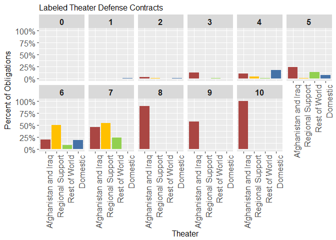<!-- -->

```r
Points<-ddply(FullData,
                .(
                  Fiscal.Year,
                  IsOCOcrisisFunding,
                  OCOscoreBuckets
                  ),
                plyr::summarise,
                Obligations=sum(Obligation.2015)
                )


Points<-ddply(Points,
                .(
                  Fiscal.Year,
                  IsOCOcrisisFunding
                  ),
                plyr::mutate,
                pObligations=Obligations/sum(Obligations)
                )


LatticePlotWrapper(
  VAR.color.legend.label="OCO labeling detail",
  VAR.main.label="Defense Contracts",
  VAR.X.label="Fiscal Year",
  VAR.Y.label="Percent of Obligations",
  VAR.Coloration=Coloration,
  VAR.long.DF=Points,
  # NA, #VAR.ncol
  VAR.x.variable="Fiscal.Year", #VAR.x.variable
  VAR.y.variable="pObligations", #VAR.y.variable
  VAR.y.series="OCOscoreBuckets", #VAR.y.series
  VAR.facet.primary="IsOCOcrisisFunding" #VAR.facet.primary
  # VAR.facet.secondary= NULL # VAR.facet.secondary=NA
  # ,MovingAverage=0
  # ,MovingSides=1
  ,DataLabels=FALSE
  #                       ,VAR.override.coloration=NA
)+ scale_y_continuous("Percent of Obligations",
                     labels = scales::percent)+
  theme(axis.text.x = element_text(angle = 90, hjust = 1))
```

```
## Scale for 'y' is already present. Adding another scale for 'y', which
## will replace the existing scale.
```

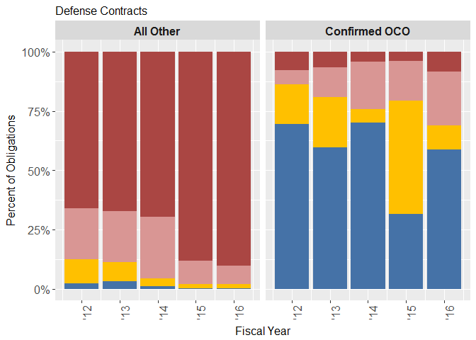<!-- -->

```r
PointsRegion<-ddply(FullData,
                .(
                  Fiscal.Year,
                  IsOCOcrisisFunding,
                  OCOscoreBuckets,
                  Theater
                  ),
                plyr::summarise,
                Obligations=sum(Obligation.2015)
                )

PointsRegion<-ddply(PointsRegion,
                .(
                  Fiscal.Year,
                  IsOCOcrisisFunding,
                  Theater
                  ),
                plyr::mutate,
                pObligations=Obligations/sum(Obligations)
                )

PointsRegion$OCOscoreBuckets<-ordered(PointsRegion$OCOscoreBuckets)

LatticePlotWrapper(
  VAR.color.legend.label="OCO labeling detail",
  VAR.main.label="Defense Contracts",
  VAR.X.label="Fiscal Year",
  VAR.Y.label="Percent of Obligations",
  VAR.Coloration=Coloration,
  VAR.long.DF=subset(PointsRegion,!is.na(Theater)),
  # NA, #VAR.ncol
  VAR.x.variable="Fiscal.Year", #VAR.x.variable
  VAR.y.variable="pObligations", #VAR.y.variable
  VAR.y.series="OCOscoreBuckets", #VAR.y.series
  VAR.facet.primary="IsOCOcrisisFunding", #VAR.facet.primary
  VAR.facet.secondary= "Theater" # VAR.facet.secondary=NA
  # ,MovingAverage=0
  # ,MovingSides=1
  ,DataLabels=FALSE
  #                       ,VAR.override.coloration=NA
)+ scale_y_continuous("Percent of Obligations",
                     labels = scales::percent)+
  theme(axis.text.x = element_text(angle = 90, hjust = 1))
```

```
## Scale for 'y' is already present. Adding another scale for 'y', which
## will replace the existing scale.
```

```
## Warning in grid.Call(C_textBounds, as.graphicsAnnot(x$label), x$x, x$y, :
## font family not found in Windows font database
```

```
## Warning in grid.Call(C_textBounds, as.graphicsAnnot(x$label), x$x, x$y, :
## font family not found in Windows font database
```

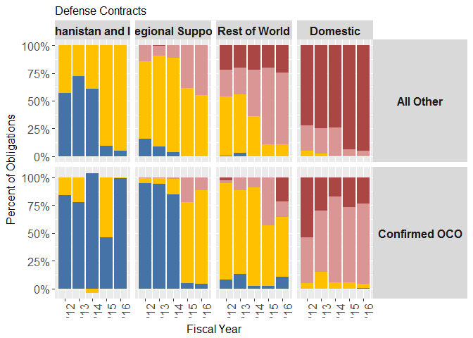<!-- -->


##Labeling

```r
FullData$OCOlabelDetail<-FullData$OCOscoreBuckets
levels(FullData$OCOlabelDetail) <- 
  c(levels(FullData$OCOlabelDetail),"Confirmed OCO")
FullData$OCOlabelDetail[FullData$CrisisFunding=="OCO"]<-"Confirmed OCO"


FullData$IsCSISOCO<-"All Other"
FullData$IsCSISOCO[FullData$CrisisFunding=="OCO"|FullData$OCOcrisisScore>=6]<-"Confident OCO"


  


Dollars<-ddply(FullData,
                .(
                  Fiscal.Year,
                  OCOlabelDetail,
                  IsCSISOCO
                  ),
                plyr::summarise,
                Obligations=sum(Obligation.2015)
                )


LatticePlotWrapper(
  VAR.color.legend.label="OCO labeling detail",
  VAR.main.label="All Defense Contracts",
  VAR.X.label="Fiscal Year",
  VAR.Y.label="Obligations (2015 $ Billions)",
  VAR.Coloration=Coloration,
  VAR.long.DF=Dollars,
  # NA, #VAR.ncol
  VAR.x.variable="Fiscal.Year", #VAR.x.variable
  VAR.y.variable="Obligations", #VAR.y.variable
  VAR.y.series="OCOlabelDetail", #VAR.y.series
  VAR.facet.primary="IsCSISOCO" #VAR.facet.primary
  # VAR.facet.secondary= NULL # VAR.facet.secondary=NA
  # ,MovingAverage=0
  # ,MovingSides=1
  ,DataLabels=FALSE
  #                       ,VAR.override.coloration=NA
)+theme(legend.position="bottom")
```

<!-- -->

```r
DollarsTheater<-ddply(FullData,
                .(
                  Fiscal.Year,
                  OCOlabelDetail,
                  IsCSISOCO,
                  Theater
                  ),
                plyr::summarise,
                Obligations=sum(Obligation.2015)
                )


FullData[FullData$PlaceCountryText %in% c("Jordan","Turkey"),]
```

```
##  [1] Fiscal.Year                        Vendor.Size                       
##  [3] ProductOrServiceArea               CompetitionClassification         
##  [5] ClassifyNumberOfOffers             SimpleArea                        
##  [7] ContractCrisisFunding              ContractingCustomer               
##  [9] ContractingSubCustomer             nationalinterestactioncodeText    
## [11] NIAcrisisFunding                   IsOCOcrisisFunding                
## [13] CrisisFunding                      CrisisFundingTheater              
## [15] PlaceCountryText                   VendorCountryText                 
## [17] VendorPlaceType                    UnmodifiedUltimateDurationCategory
## [19] OMBagencyName                      OMBbureauName                     
## [21] isUndefinitizedAction              OCOcrisisScore                    
## [23] OfficeOCOcrisisScore               Action.Obligation                 
## [25] numberOfActions                    Competition.detail                
## [27] Competition.sum                    Competition.effective.only        
## [29] Competition.multisum               No.Competition.sum                
## [31] ProductServiceOrRnDarea            ServicesCategory.detail           
## [33] ServicesCategory.sum               ProductsCategory.detail           
## [35] ProductOrServiceArea.DLA           ProductOrServicesCategory.Graph   
## [37] ProductServiceOrRnDarea.sum        SupplyServiceFRC                  
## [39] SupplyServiceERS                   Vendor.Size.detail                
## [41] Vendor.Size.sum                    Shiny.VendorSize                  
## [43] Deflator.2005                      Deflator.2011                     
## [45] Deflator.2012                      Deflator.2013                     
## [47] Deflator.2014                      Deflator.2015                     
## [49] Deflator.2016                      Obligation.2013                   
## [51] Obligation.2014                    Obligation.2015                   
## [53] LogOfAction.Obligation             Fiscal.Year.End                   
## [55] Fiscal.Year.Start                  Graph                             
## [57] OCOscoreBuckets                    OCOscore                          
## [59] Theater                            International                     
## [61] OCOlabelDetail                     IsCSISOCO                         
## <0 rows> (or 0-length row.names)
```

```r
LatticePlotWrapper(
  VAR.color.legend.label="OCO labeling detail",
  VAR.main.label="Defense Contracts with Labeled Theater",
  VAR.X.label="Fiscal Year",
  VAR.Y.label="Obligations (2015 $ Billions)",
  VAR.Coloration=Coloration,
  VAR.long.DF=subset(DollarsTheater,!is.na(Theater)),
  # NA, #VAR.ncol
  VAR.x.variable="Fiscal.Year", #VAR.x.variable
  VAR.y.variable="Obligations", #VAR.y.variable
  VAR.y.series="OCOlabelDetail", #VAR.y.series
  VAR.facet.primary="Theater", #VAR.facet.primary
  VAR.facet.secondary="IsCSISOCO" # VAR.facet.secondary=NA
  # ,MovingAverage=0
  # ,MovingSides=1
  # ,DataLabels=NA
  #                       ,VAR.override.coloration=NA
)+theme(legend.position="right")
```

```
## Warning in grid.Call(C_textBounds, as.graphicsAnnot(x$label), x$x, x$y, :
## font family not found in Windows font database

## Warning in grid.Call(C_textBounds, as.graphicsAnnot(x$label), x$x, x$y, :
## font family not found in Windows font database
```

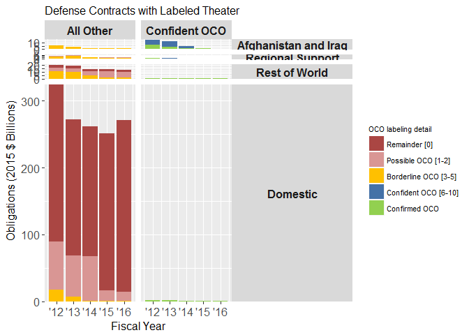<!-- -->

```r
DollarsInternational<-ddply(FullData,
                .(
                  Fiscal.Year,
                  OCOlabelDetail,
                  IsCSISOCO,
                  International
                  ),
                plyr::summarise,
                Obligations=sum(Obligation.2015)
                )


FullData[FullData$PlaceCountryText %in% c("Jordan","Turkey"),]
```

```
##  [1] Fiscal.Year                        Vendor.Size                       
##  [3] ProductOrServiceArea               CompetitionClassification         
##  [5] ClassifyNumberOfOffers             SimpleArea                        
##  [7] ContractCrisisFunding              ContractingCustomer               
##  [9] ContractingSubCustomer             nationalinterestactioncodeText    
## [11] NIAcrisisFunding                   IsOCOcrisisFunding                
## [13] CrisisFunding                      CrisisFundingTheater              
## [15] PlaceCountryText                   VendorCountryText                 
## [17] VendorPlaceType                    UnmodifiedUltimateDurationCategory
## [19] OMBagencyName                      OMBbureauName                     
## [21] isUndefinitizedAction              OCOcrisisScore                    
## [23] OfficeOCOcrisisScore               Action.Obligation                 
## [25] numberOfActions                    Competition.detail                
## [27] Competition.sum                    Competition.effective.only        
## [29] Competition.multisum               No.Competition.sum                
## [31] ProductServiceOrRnDarea            ServicesCategory.detail           
## [33] ServicesCategory.sum               ProductsCategory.detail           
## [35] ProductOrServiceArea.DLA           ProductOrServicesCategory.Graph   
## [37] ProductServiceOrRnDarea.sum        SupplyServiceFRC                  
## [39] SupplyServiceERS                   Vendor.Size.detail                
## [41] Vendor.Size.sum                    Shiny.VendorSize                  
## [43] Deflator.2005                      Deflator.2011                     
## [45] Deflator.2012                      Deflator.2013                     
## [47] Deflator.2014                      Deflator.2015                     
## [49] Deflator.2016                      Obligation.2013                   
## [51] Obligation.2014                    Obligation.2015                   
## [53] LogOfAction.Obligation             Fiscal.Year.End                   
## [55] Fiscal.Year.Start                  Graph                             
## [57] OCOscoreBuckets                    OCOscore                          
## [59] Theater                            International                     
## [61] OCOlabelDetail                     IsCSISOCO                         
## <0 rows> (or 0-length row.names)
```

```r
OCOdetail<-LatticePlotWrapper(
  VAR.color.legend.label="OCO labeling detail",
  VAR.main.label="Defense Contracts with Labeled Location",
  VAR.X.label="Fiscal Year",
  VAR.Y.label="Obligations (2015 $ Billions)",
  VAR.Coloration=Coloration,
  VAR.long.DF=subset(DollarsInternational,!is.na(International)),
  # NA, #VAR.ncol
  VAR.x.variable="Fiscal.Year", #VAR.x.variable
  VAR.y.variable="Obligations", #VAR.y.variable
  VAR.y.series="OCOlabelDetail", #VAR.y.series
  VAR.facet.primary="International", #VAR.facet.primary
  VAR.facet.secondary="IsCSISOCO" # VAR.facet.secondary=NA
  # ,MovingAverage=0
  # ,MovingSides=1
  # ,DataLabels=NA
  #                       ,VAR.override.coloration=NA
)

OCOdetail+theme(legend.position="right")
```

```
## Warning in grid.Call(C_textBounds, as.graphicsAnnot(x$label), x$x, x$y, :
## font family not found in Windows font database

## Warning in grid.Call(C_textBounds, as.graphicsAnnot(x$label), x$x, x$y, :
## font family not found in Windows font database
```

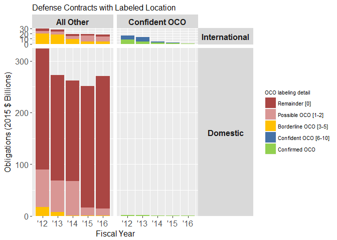<!-- -->
#Analyisis
##Country

```r
Country<-ddply(FullData,
                .(Fiscal.Year,
                  IsCSISOCO,
                  PlaceCountryText,
                  Theater
                  ),
                plyr::summarise,
                Obligations=sum(Obligation.2015)
                )

write.csv(Country,file.path("Output","Country.csv"))


LatticePlotWrapper(
  VAR.color.legend.label="OCO labeling detail",
  VAR.main.label="All Defense Contracts",
  VAR.X.label="Fiscal Year",
  VAR.Y.label="Obligations (2015 $ Billions)",
  VAR.Coloration=Coloration,
  VAR.long.DF=Dollars,
  # NA, #VAR.ncol
  VAR.x.variable="Fiscal.Year", #VAR.x.variable
  VAR.y.variable="Obligations", #VAR.y.variable
  VAR.y.series="OCOlabelDetail", #VAR.y.series
  VAR.facet.primary="IsCSISOCO" #VAR.facet.primary
  # VAR.facet.secondary= NULL # VAR.facet.secondary=NA
  # ,MovingAverage=0
  # ,MovingSides=1
  ,DataLabels=FALSE
  #                       ,VAR.override.coloration=NA
)+theme(legend.position="bottom")
```

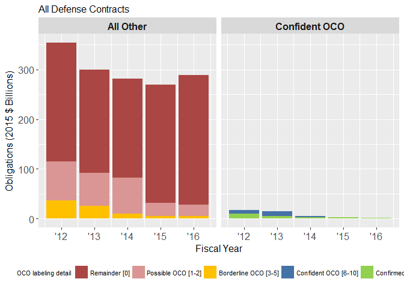<!-- -->

```r
OCOdetailZoom<-LatticePlotWrapper(
  VAR.color.legend.label="OCO labeling detail",
  VAR.main.label="Confident OCO or International Defense Contracts",
  VAR.X.label="Fiscal Year",
  VAR.Y.label="Obligations (2015 $ Billions)",
  VAR.Coloration=Coloration,
  VAR.long.DF=subset(DollarsInternational,
                     (IsCSISOCO=="Confident OCO" | 
                       International=="International") & 
                       !is.na(International)),
  # NA, #VAR.ncol
  VAR.x.variable="Fiscal.Year", #VAR.x.variable
  VAR.y.variable="Obligations", #VAR.y.variable
  VAR.y.series="OCOlabelDetail", #VAR.y.series
  VAR.facet.primary="International", #VAR.facet.primary
  VAR.facet.secondary="IsCSISOCO" # VAR.facet.secondary=NA
  # ,MovingAverage=0
  # ,MovingSides=1
  # ,DataLabels=NA
  #                       ,VAR.override.coloration=NA
)

OCOdetailZoom+theme(legend.position="bottom")
```

```
## Warning in grid.Call(C_textBounds, as.graphicsAnnot(x$label), x$x, x$y, :
## font family not found in Windows font database

## Warning in grid.Call(C_textBounds, as.graphicsAnnot(x$label), x$x, x$y, :
## font family not found in Windows font database
```

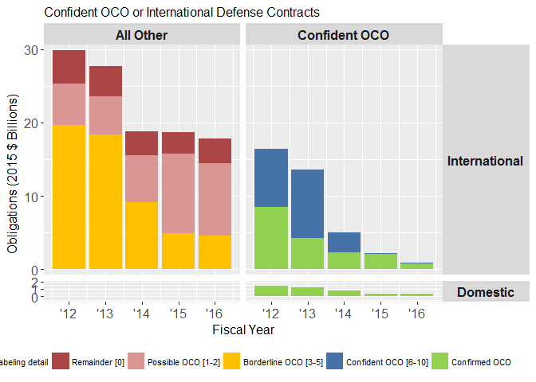<!-- -->


##Competition

```r
FullData$No.Competition.sum<-ordered(
  FullData$No.Competition.sum,
  c("2+ Offers","1 Offer", 
    "No Comp. (Only 1 Source)",
    "Follow on to Competed Action",
    "No Comp. (Other)",
    "No Comp. (Unlabeled)"    ,
    "Unlabeled"
                                                        ))


#Competition and Simple Area
CompetitionSupplyServiceERS<-ddply(FullData,
                .(
                  Fiscal.Year,
                  IsCSISOCO,
                  No.Competition.sum,
                  SupplyServiceERS
                  ),
                plyr::summarise,
                Obligations=sum(Obligation.2015)
                )

CompetitionSupplyServiceERS<-ddply(CompetitionSupplyServiceERS,
                .(
                  Fiscal.Year,
                  IsCSISOCO,
                  SupplyServiceERS
                  ),
                plyr::mutate,
                pObligations=Obligations/sum(Obligations)
                )


  LatticePercentLineWrapper(
  VAR.color.legend.label="Competition",
  VAR.main.label="",
  VAR.X.label="Fiscal Year",
  VAR.Y.label="Percent of Obligations",
  VAR.Coloration=Coloration,
  VAR.long.DF=subset(CompetitionSupplyServiceERS,
                     SupplyServiceERS!="Unlabeled"),
  # NA, #VAR.ncol
  VAR.x.variable="Fiscal.Year", #VAR.x.variable
  VAR.y.variable="Obligations", #VAR.y.variable
  VAR.y.series="No.Competition.sum", #VAR.y.series
  VAR.facet.primary="IsCSISOCO", #VAR.facet.primary
  VAR.facet.secondary="SupplyServiceERS" # VAR.facet.secondary=NA
  # ,MovingAverage=0
  # ,MovingSides=1
  # ,DataLabels=NA
  #                       ,VAR.override.coloration=NA
)+theme(legend.position = "bottom")+
    scale_x_date("Fiscal Year",labels = date_format("'%y"))+
  theme(strip.text.y = element_text(angle=270))
```

```
## Warning: Ignoring unknown parameters: NA
```

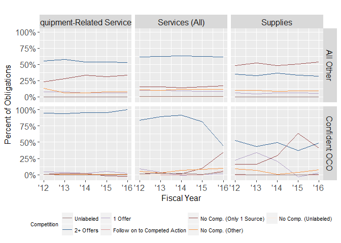<!-- -->

```r
LatticePlotWrapper(
  VAR.color.legend.label="Competition",
  VAR.main.label="Confident OCO and Labeled Product or Service Defense Contracts",
  VAR.X.label="Fiscal Year",
  VAR.Y.label="Obligations (2015 $ Billions)",
  VAR.Coloration=Coloration,
  VAR.long.DF=subset(CompetitionSupplyServiceERS,
                     SupplyServiceERS!="Unlabeled"&
                       IsCSISOCO=="Confident OCO"),
  # NA, #VAR.ncol
  VAR.x.variable="Fiscal.Year", #VAR.x.variable
  VAR.y.variable="Obligations", #VAR.y.variable
  VAR.y.series="No.Competition.sum", #VAR.y.series
  VAR.facet.primary="IsCSISOCO", #VAR.facet.primary
  VAR.facet.secondary="SupplyServiceERS" # VAR.facet.secondary=NA
  # ,MovingAverage=0
  # ,MovingSides=1
  # ,DataLabels=NA
  #                       ,VAR.override.coloration=NA
)+theme(legend.position = "bottom")
```

```
## Warning in grid.Call(C_textBounds, as.graphicsAnnot(x$label), x$x, x$y, :
## font family not found in Windows font database
```

```
## Warning in grid.Call(C_textBounds, as.graphicsAnnot(x$label), x$x, x$y, :
## font family not found in Windows font database
```

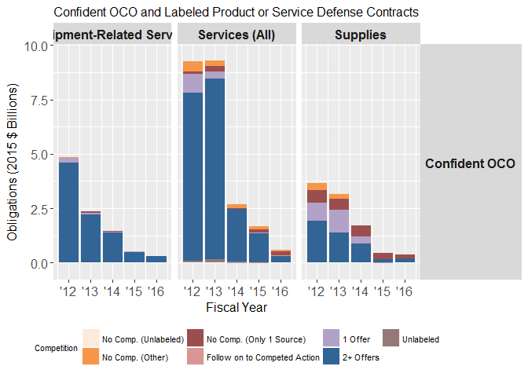<!-- -->

```r
#Competition and Duration
CompetitionDuration<-ddply(FullData,
                .(
                  Fiscal.Year,
                  IsCSISOCO,
                  UnmodifiedUltimateDurationCategory,
                  Competition.sum
                  ),
                plyr::summarise,
                Obligations=sum(Obligation.2015)
                )

CompetitionDuration<-ddply(CompetitionDuration,
                .(
                  Fiscal.Year,
                  IsCSISOCO,
                  UnmodifiedUltimateDurationCategory
                  ),
                plyr::mutate,
                pObligations=Obligations/sum(Obligations)
                )


#Breakdown by number of offers
LatticePlotWrapper(
  VAR.color.legend.label="Competition",
  VAR.main.label="Confident OCO and Labeled Duration Defense Contracts",
  VAR.X.label="Fiscal Year",
  VAR.Y.label="Obligations (2015 $ Billions)",
  VAR.Coloration=Coloration,
  VAR.long.DF=subset(FullData,
                     !is.na(UnmodifiedUltimateDurationCategory)),
  # NA, #VAR.ncol
  VAR.x.variable="Fiscal.Year", #VAR.x.variable
  VAR.y.variable="Obligation.2015", #VAR.y.variable
  VAR.y.series="Competition.sum", #VAR.y.series
  VAR.facet.primary="IsCSISOCO", #VAR.facet.primary
  VAR.facet.secondary="UnmodifiedUltimateDurationCategory" # VAR.facet.secondary=NA
  # ,MovingAverage=0
  # ,MovingSides=1
  # ,DataLabels=NA
  #                       ,VAR.override.coloration=NA
)+theme(legend.position = "bottom")+
   facet_grid(  primary~ secondary,scales="free_y")
```

```
## Warning in grid.Call(C_textBounds, as.graphicsAnnot(x$label), x$x, x$y, :
## font family not found in Windows font database

## Warning in grid.Call(C_textBounds, as.graphicsAnnot(x$label), x$x, x$y, :
## font family not found in Windows font database
```

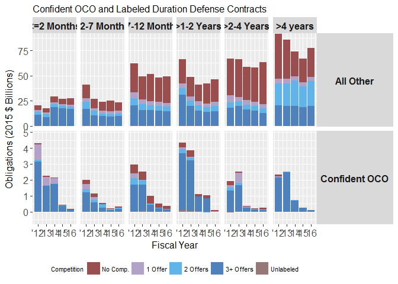<!-- -->

```r
  LatticePercentLineWrapper(
  VAR.color.legend.label="Competition",
  VAR.main.label="",
  VAR.X.label="Fiscal Year",
  VAR.Y.label="Percent of Obligations",
  VAR.Coloration=Coloration,
  VAR.long.DF=subset(CompetitionDuration,
                     !is.na(UnmodifiedUltimateDurationCategory)),
  # NA, #VAR.ncol
  VAR.x.variable="Fiscal.Year", #VAR.x.variable
  VAR.y.variable="Obligations", #VAR.y.variable
  VAR.y.series="Competition.sum", #VAR.y.series
  VAR.facet.primary="IsCSISOCO", #VAR.facet.primary
  VAR.facet.secondary="UnmodifiedUltimateDurationCategory" # VAR.facet.secondary=NA
  # ,MovingAverage=0
  # ,MovingSides=1
  # ,DataLabels=NA
  #                       ,VAR.override.coloration=NA
)+theme(legend.position = "bottom")+
    scale_x_date("Fiscal Year",labels = date_format("'%y"))+
  theme(strip.text.y = element_text(angle=270))
```

```
## Warning: Ignoring unknown parameters: NA
```

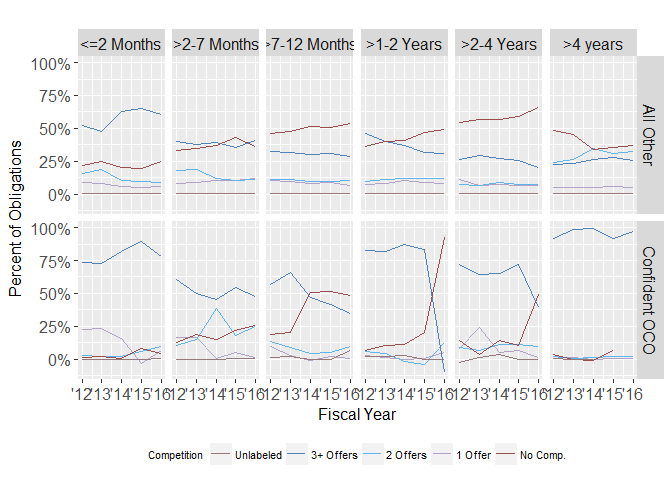<!-- -->

```r
#Breakdown by reason not competed 
LatticePlotWrapper(
  VAR.color.legend.label="Competition",
  VAR.main.label="Confident OCO and Labeled Duration Defense Contracts",
  VAR.X.label="Fiscal Year",
  VAR.Y.label="Obligations (2015 $ Billions)",
  VAR.Coloration=Coloration,
  VAR.long.DF=subset(FullData,
                     !is.na(UnmodifiedUltimateDurationCategory)),
  # NA, #VAR.ncol
  VAR.x.variable="Fiscal.Year", #VAR.x.variable
  VAR.y.variable="Obligation.2015", #VAR.y.variable
  VAR.y.series="No.Competition.sum", #VAR.y.series
  VAR.facet.primary="IsCSISOCO", #VAR.facet.primary
  VAR.facet.secondary="UnmodifiedUltimateDurationCategory" # VAR.facet.secondary=NA
  # ,MovingAverage=0
  # ,MovingSides=1
  # ,DataLabels=NA
  #                       ,VAR.override.coloration=NA
)+theme(legend.position = "bottom")+
   facet_grid(  primary~ secondary,scales="free_y")
```

```
## Warning in grid.Call(C_textBounds, as.graphicsAnnot(x$label), x$x, x$y, :
## font family not found in Windows font database

## Warning in grid.Call(C_textBounds, as.graphicsAnnot(x$label), x$x, x$y, :
## font family not found in Windows font database
```

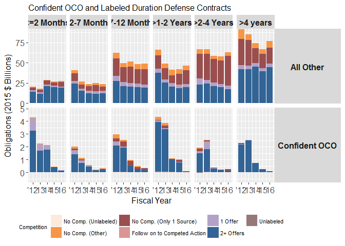<!-- -->

```r
  LatticePercentLineWrapper(
  VAR.color.legend.label="Competition",
  VAR.main.label="",
  VAR.X.label="Fiscal Year",
  VAR.Y.label="Percent of Obligations",
  VAR.Coloration=Coloration,
  VAR.long.DF=subset(FullData,
                     !is.na(UnmodifiedUltimateDurationCategory)),
  # NA, #VAR.ncol
  VAR.x.variable="Fiscal.Year", #VAR.x.variable
  VAR.y.variable="Obligation.2015", #VAR.y.variable
  VAR.y.series="No.Competition.sum", #VAR.y.series
  VAR.facet.primary="IsCSISOCO", #VAR.facet.primary
  VAR.facet.secondary="UnmodifiedUltimateDurationCategory" # VAR.facet.secondary=NA
  # ,MovingAverage=0
  # ,MovingSides=1
  # ,DataLabels=NA
  #                       ,VAR.override.coloration=NA
)+theme(legend.position = "bottom")+
    scale_x_date("Fiscal Year",labels = date_format("'%y"))+
  theme(strip.text.y = element_text(angle=270))
```

```
## Warning: Ignoring unknown parameters: NA
```

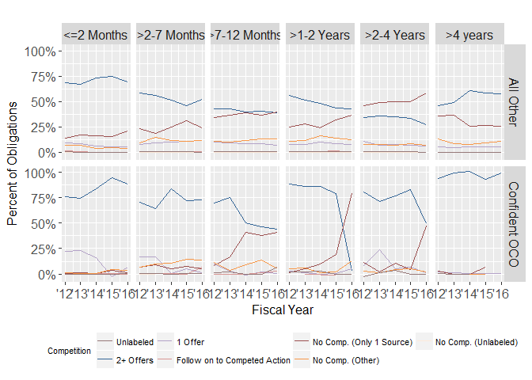<!-- -->

```r
#Breakdown by reason not competed 
#Start Fiscal Year 
```


##Undefinitized Contract Actions

```r
# FullData$isUCA<-"Not UCA"
# FullData$isUCA[FullData$isUndefinitizedAction==1]
# FullData$isUndefinitizedAction[is.na(FullData$isUndefinitizedAction)]<-"Not UCA"
FullData$isUCA<-factor(FullData$isUndefinitizedAction,levels=c(1,0,NA),labels=c("UCA","Not UCA"))

FullData$isUCA<-addNA(FullData$isUCA,ifany=TRUE)
levels(FullData$isUCA)[is.na(levels(FullData$isUCA))] <- "Unlabeled"
unique(FullData$isUndefinitizedAction)
```

```
## [1]  0 NA  1
```

```r
#UCA and Simple Area
UCASupplyServiceERS<-ddply(FullData,
                .(
                  Fiscal.Year,
                  IsCSISOCO,
                  isUCA,
                  SupplyServiceERS
                  ),
                plyr::summarise,
                Obligations=sum(Obligation.2015)
                )

UCASupplyServiceERS<-ddply(UCASupplyServiceERS,
                .(
                  Fiscal.Year,
                  IsCSISOCO,
                  SupplyServiceERS
                  ),
                plyr::mutate,
                pObligations=Obligations/sum(Obligations)
                )


# UCASupplyServiceERS$Graph<-TRUE
# UCASupplyServiceERS$Graph[UCASupplyServiceERS$isUCA=='Not UCA']<-FALSE

LatticePercentLineWrapper(
  VAR.color.legend.label="Is Undefinitized Contract Action (UCA)",
  VAR.main.label="Defense Contracts with Labeled Cector",
  VAR.X.label="Fiscal Year",
  VAR.Y.label="Percent of Obligations",
  VAR.Coloration=Coloration,
  VAR.long.DF=subset(UCASupplyServiceERS,SupplyServiceERS!="Unlabeled"),
  # NA, #VAR.ncol
  VAR.x.variable="Fiscal.Year", #VAR.x.variable
  VAR.y.variable="Obligations", #VAR.y.variable
  VAR.y.series="isUCA", #VAR.y.series
  VAR.facet.primary="IsCSISOCO", #VAR.facet.primary
  VAR.facet.secondary="SupplyServiceERS" # VAR.facet.secondary=NA
  # ,MovingAverage=0
  # ,MovingSides=1
  # ,DataLabels=NA
  #                       ,VAR.override.coloration=NA
)+theme(legend.position = "bottom")+
    scale_x_date("Fiscal Year",labels = date_format("'%y"))+
  theme(strip.text.y = element_text(angle=270))
```

```
## Warning: Ignoring unknown parameters: NA
```

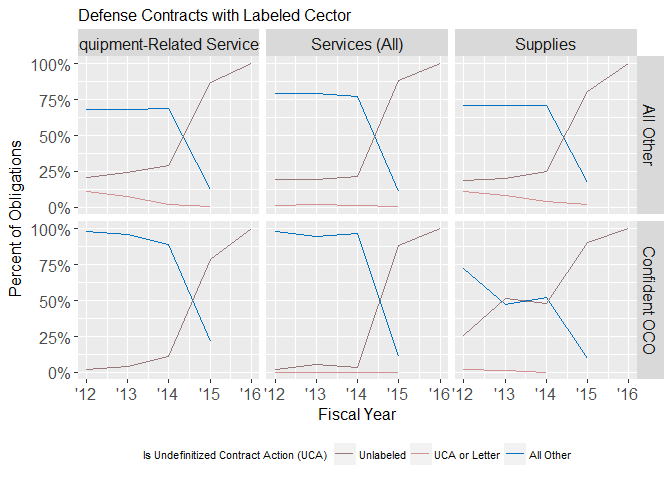<!-- -->

```r
#UCA and Duration
UCADuration<-ddply(FullData,
                .(
                  Fiscal.Year,
                  IsCSISOCO,
                  UnmodifiedUltimateDurationCategory,
                  isUCA
                  ),
                plyr::summarise,
                Obligations=sum(Obligation.2015)
                )

UCADuration<-ddply(UCADuration,
                .(
                  Fiscal.Year,
                  IsCSISOCO,
                  UnmodifiedUltimateDurationCategory
                  ),
                plyr::mutate,
                pObligations=Obligations/sum(Obligations)
                )

LatticePercentLineWrapper(
  VAR.color.legend.label="Is Undefinitized Contract Action (UCA)",
  VAR.main.label="Defense Contracts with Labeled Cector",
  VAR.X.label="Fiscal Year",
  VAR.Y.label="Percent of Obligations",
  VAR.Coloration=Coloration,
  VAR.long.DF=subset(UCADuration,!is.na(UnmodifiedUltimateDurationCategory)),
  # NA, #VAR.ncol
  VAR.x.variable="Fiscal.Year", #VAR.x.variable
  VAR.y.variable="Obligations", #VAR.y.variable
  VAR.y.series="isUCA", #VAR.y.series
  VAR.facet.primary="IsCSISOCO", #VAR.facet.primary
  VAR.facet.secondary="UnmodifiedUltimateDurationCategory" # VAR.facet.secondary=NA
  # ,MovingAverage=0
  # ,MovingSides=1
  # ,DataLabels=NA
  #                       ,VAR.override.coloration=NA
)+theme(legend.position = "bottom")+
    scale_x_date("Fiscal Year",labels = date_format("'%y"))+
  theme(strip.text.y = element_text(angle=270))
```

```
## Warning: Ignoring unknown parameters: NA
```

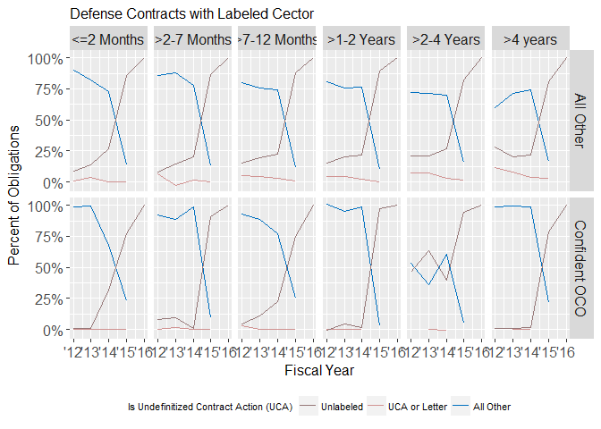<!-- -->

```r
#Breakdown by reason not competed 
LatticePlotWrapper(
  VAR.color.legend.label="Undefinitized Contract Action (UCA)",
  VAR.main.label="Labeled UCA Status and Duration Defense Contracts",
  VAR.X.label="Fiscal Year",
  VAR.Y.label="Obligations (2015 $ Billions)",
  VAR.Coloration=Coloration,
  VAR.long.DF=subset(UCADuration,
                     !is.na(UnmodifiedUltimateDurationCategory)),
  # NA, #VAR.ncol
  VAR.x.variable="Fiscal.Year", #VAR.x.variable
  VAR.y.variable="Obligations", #VAR.y.variable
  VAR.y.series="isUCA", #VAR.y.series
  VAR.facet.primary="IsCSISOCO", #VAR.facet.primary
  VAR.facet.secondary="UnmodifiedUltimateDurationCategory" # VAR.facet.secondary=NA
  # ,MovingAverage=0
  # ,MovingSides=1
  # ,DataLabels=NA
  #                       ,VAR.override.coloration=NA
)+theme(legend.position = "bottom")+
   facet_grid(  primary~ secondary,scales="free_y")
```

```
## Warning in grid.Call(C_textBounds, as.graphicsAnnot(x$label), x$x, x$y, :
## font family not found in Windows font database
```

```
## Warning in grid.Call(C_textBounds, as.graphicsAnnot(x$label), x$x, x$y, :
## font family not found in Windows font database
```

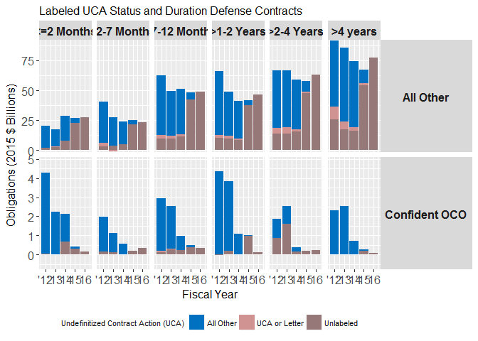<!-- -->


##Reachback

```r
FullData$Reachback<-cut2(FullData$OfficeOCOcrisisScore,c(2))

FullData$Reachback<-factor(FullData$Reachback,levels=c( "[ 2, 3]","[-1, 2)"), 
                                   labels=c( "Contigency-Contracting-Intensive Contracting Offices","All Other Offices"))

#Competition and Reachback
CompetitionReachback<-ddply(FullData,
                .(
                  Fiscal.Year,
                  IsCSISOCO,
                  Reachback,
                  No.Competition.sum
                  ),
                plyr::summarise,
                Obligations=sum(Obligation.2015)
                )

CompetitionReachback<-ddply(CompetitionReachback,
                .(
                  Fiscal.Year,
                  IsCSISOCO,
                  Reachback
                  ),
                plyr::mutate,
                pObligations=Obligations/sum(Obligations)
                )


LatticePercentLineWrapper(
  VAR.color.legend.label="Is Undefinitized Contract Action (UCA)",
  VAR.main.label="Defense Contracts with Labeled Reachback",
  VAR.X.label="Fiscal Year",
  VAR.Y.label="Percent of Obligations",
  VAR.Coloration=Coloration,
  VAR.long.DF=subset(CompetitionReachback,!is.na(Reachback)),
  # NA, #VAR.ncol
  VAR.x.variable="Fiscal.Year", #VAR.x.variable
  VAR.y.variable="Obligations", #VAR.y.variable
  VAR.y.series="No.Competition.sum", #VAR.y.series
  VAR.facet.primary="IsCSISOCO", #VAR.facet.primary
  VAR.facet.secondary="Reachback" # VAR.facet.secondary=NA
  # ,MovingAverage=0
  # ,MovingSides=1
  # ,DataLabels=NA
  #                       ,VAR.override.coloration=NA
)+theme(legend.position = "bottom")+
    scale_x_date("Fiscal Year",labels = date_format("'%y"))+
  theme(strip.text.y = element_text(angle=270))
```

```
## Warning: Ignoring unknown parameters: NA
```

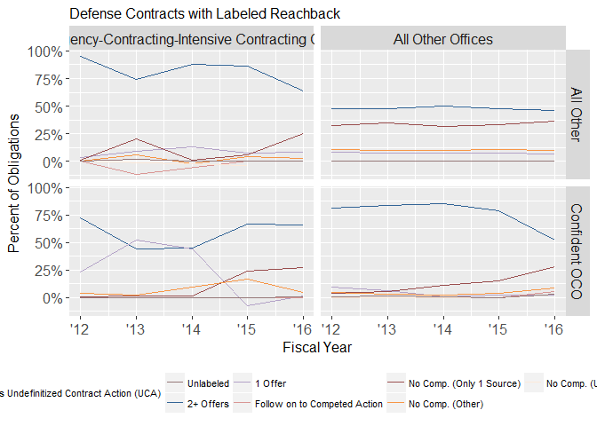<!-- -->

```r
#UCA and Reachback
UCAReachback<-ddply(FullData,
                .(
                  Fiscal.Year,
                  IsCSISOCO,
                  Reachback,
                  isUCA
                  ),
                plyr::summarise,
                Obligations=sum(Obligation.2015)
                )

UCAReachback<-ddply(UCAReachback,
                .(
                  Fiscal.Year,
                  IsCSISOCO,
                  Reachback
                  ),
                plyr::mutate,
                pObligations=Obligations/sum(Obligations)
                )


LatticePercentLineWrapper(
  VAR.color.legend.label="Is Undefinitized Contract Action (UCA)",
  VAR.main.label="Defense Contracts with Labeled Reachback",
  VAR.X.label="Fiscal Year",
  VAR.Y.label="Percent of Obligations",
  VAR.Coloration=Coloration,
  VAR.long.DF=subset(UCAReachback,!is.na(Reachback)),
  # NA, #VAR.ncol
  VAR.x.variable="Fiscal.Year", #VAR.x.variable
  VAR.y.variable="Obligations", #VAR.y.variable
  VAR.y.series="isUCA", #VAR.y.series
  VAR.facet.primary="IsCSISOCO", #VAR.facet.primary
  VAR.facet.secondary="Reachback" # VAR.facet.secondary=NA
  # ,MovingAverage=0
  # ,MovingSides=1
  # ,DataLabels=NA
  #                       ,VAR.override.coloration=NA
)+theme(legend.position = "bottom")+
    scale_x_date("Fiscal Year",labels = date_format("'%y"))+
  theme(strip.text.y = element_text(angle=270))
```

```
## Warning: Ignoring unknown parameters: NA
```

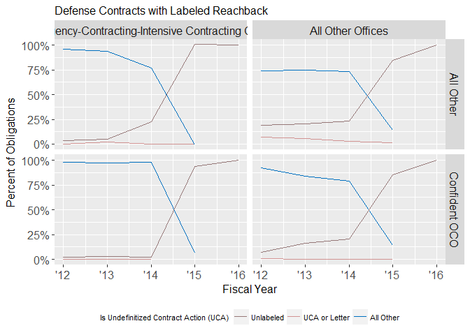<!-- -->
